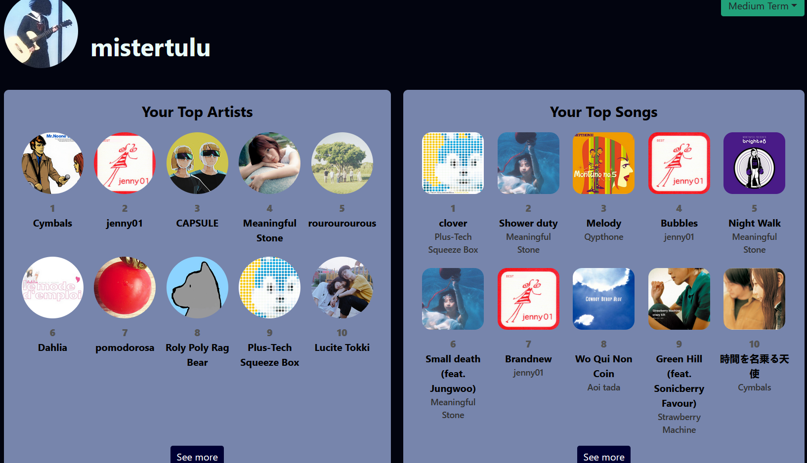
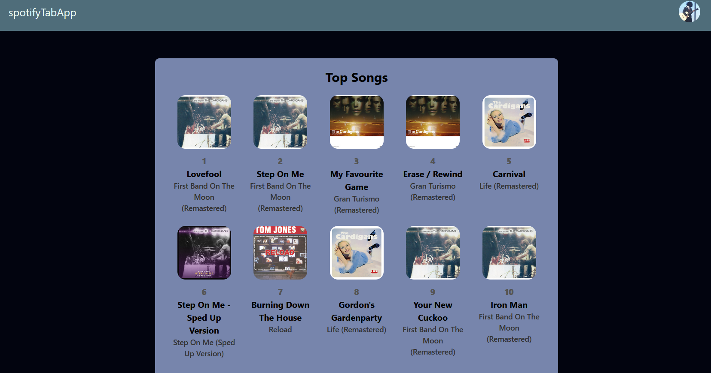
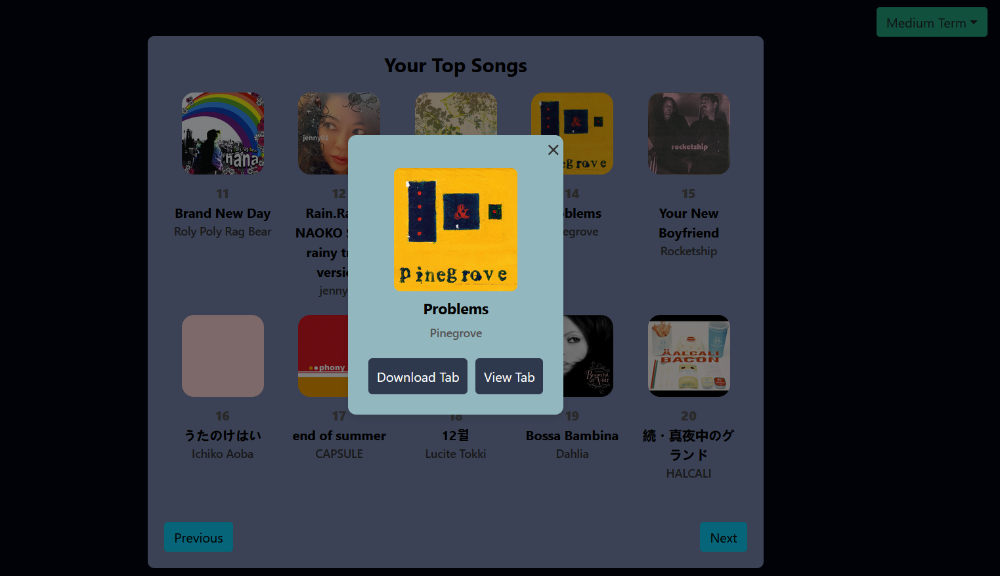

# Spotify Guitar Tabs App

  

A web application that weaves your Spotify and guitar learning experience by allowing you to explore your most played songs and artists on spotify and view guitar tabs for these songs through Songsterr. This app connects you to over 400,000 songs and 1.3 million guitar tab tracks thanks to Songsterr, allowing you to quickly find and learn the songs you love.

  

## Spotify Profile

View your personalized spotify profile by securely logging in through the use of Spotify's OAuth. Once logged in, you will be presented with a list of your top 10 songs and artists within the last 6 months. You're also able to change the time range of the artists you like to either short term (last 4 weeks), medium term (last 6 months), and long term (last 12 months). 

You can also view a more comprehensive list of these top items. By clicking view more, you can expand to list to cover your top 100 items.

## Artist Profile

If you want to view an artist's top songs, you can click on their icon in the top artists list to view a list of their top 10 songs.

## View Tabs

When clicking on a song, you are given the option to either view the song directly on the Songsterr website or a direct download link of a .gp3 file containing the song, allowing users to personally edit and fine tune tabs of their favorite songs if they so wish. Of course, the limit to the amount of songs that have the correct corresponding tabs comes down to Songsterr itself. Some songs might return incorrect tabs or none at all, either due to the lack of tabs of the song or the song being named differently on the songsterr website. I'm currently working on a way to circumvent these problems, and make it clear to users as to what songs have available and correct guitar tabs or not.

## Possible Future Features
### Checklist
Users can also choose to mark a specific song to be added to a checklist, keeping track of songs they want to learn. They can adjust songs in the checklist based on their personal priority for what songs they want to learn. Once learned, they can check the song off and add it to a list of learned songs, providing a sort of visual showcase to their guitar playing skills.

### Visualize Availability of guitar Tabs

Each song will have a little icon in the bottom right, indicating one of three statuses:

 - Green: The song has a correct corresponding guitar tab in Songsterr
 - Red: The song either doesn't have a guitar tab registered in Songsterr or is just unable to be found on Songsterr through the app's search algorithm
 - Grey: The song isn't registered in the app's database

However before I can implement this I would also need to add...

### Database of songs to Guitar Tabs
As to minimize the amount of calls made to the Songsterr servers, a database should be made that should keep track of a handful of things like:

- A song's id in Songsterr: Useful to the app's searching algorithm, provides for more accurate song searches
- Song download link: Normally two calls are made to the Songsterr servers is made to first search for the download link for the song, and then finally providing the download itself. Saving the link should prove to cut the first step out as to prevent unnecessary load to Songster

Keeping personal database should not only prevent too much unnecessary traffic to Songster, but also improve overall performance of the app, as it tries its best to isolate it's actions to the website itself. Of course, calls to Songsterr are inevitable when it comes to adding new songs to the database. 